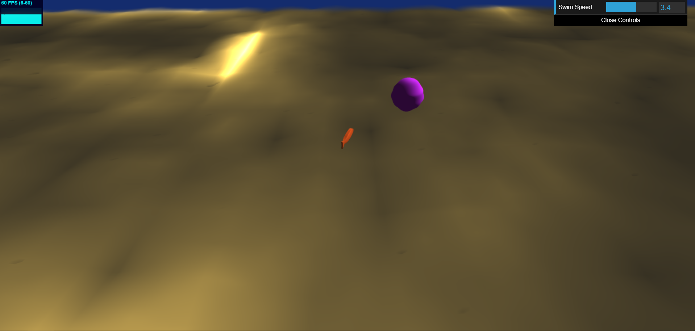
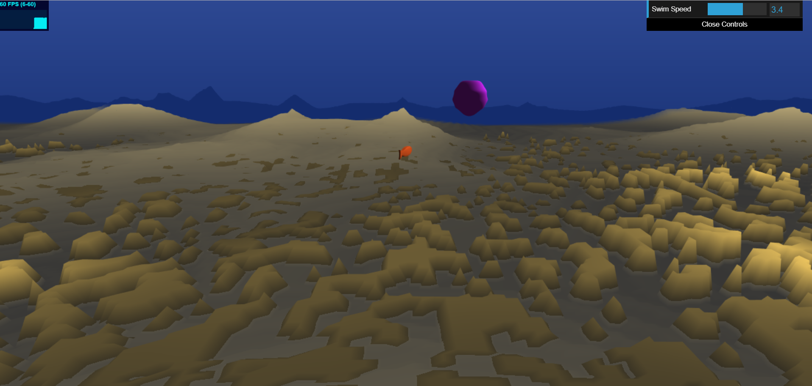
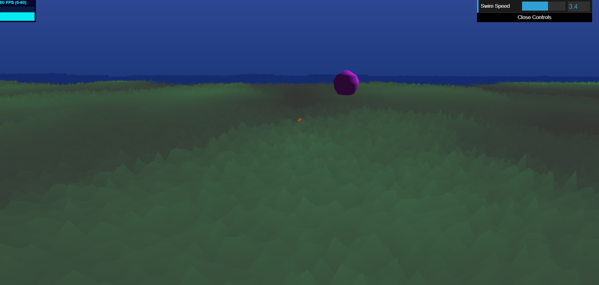
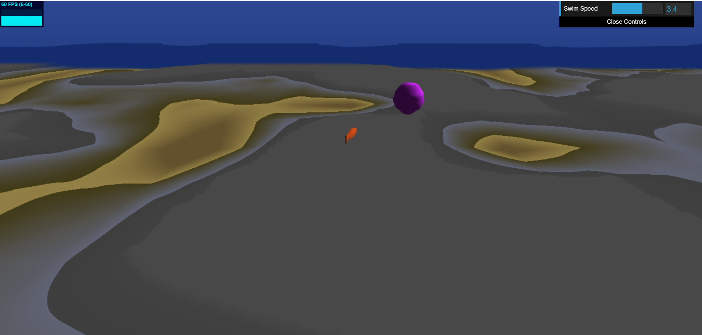

# 566-final-project README

## Erin Goldberg
pennKey: engold

You need to zoom out intially because it starts too zoomed in.

Link: https://engold.github.io/hw01-noisy-terrain

## References
- FBM from //https://thebookofshaders.com/13/
- Noise functions from Adam's lecture Slides
- Shader axis rotate method http://www.neilmendoza.com/glsl-rotation-about-an-arbitrary-axis/
- Jellyfish wave motion https://heliosinteractive.com/jelly-shader-part-2/

## Features
- Procedural Terrain
  - Use the WASD keys to explore the underwater ocean terrain.
  - There are 4 different, repeating underwater areas: shallow ground area, sandy hills, grassy area, and sand bar/rock area.
- Distance Fog is implemented, but can be improved to show more shadows in the distance
- File reading for OBJ loading - connection is there to add more types of fish.
- A small test fish is being rendered.
    - Also temp Jelly Fish geometry.
- Instance Rendering is set up but not being used yet. 
- Shader Animation is partially implemented, movement is there but not the final swim animation.
    - One Shader for all small fish
    - Another Shader for Jellyfish (currently represented as a sphere)
- Swimming speed for the player/camera is a tunable parameter in the GUI so exploration can be sped up or slowed down.

## Still Working On
- Placement of fish and plants in the environment
    - Right now a single fish is being drawn with respect to the camera and thus moves with the camera when the WASD keys are pressed, which is not right. The fish needs to be drawn independently of the camera and be placed in the enviroment, but I haven't figured out how to do that yet)
    - I still need to add other types of fish/sea creatures and plants and have them appear only in certain biome areas.
- Animation
    - I also need to do the correct swimming animation for fish, right now they bob up and down but need to do a wavy motion.
    - All animation for plants and other types of fish
- Aesthetic
    - Make everything look similar in style. I'm leaning towards going for a more stylized approached, but I need to finalize fish textures/coloring.
