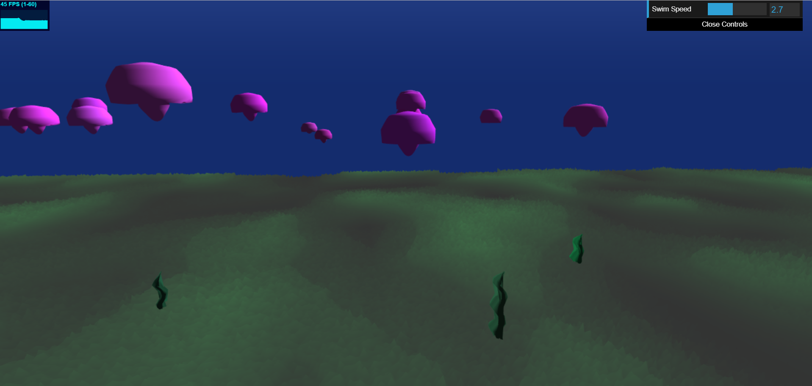

# Explorable Ocean Environment

## Erin Goldberg
pennKey: engold

You need to zoom out intially because it starts too zoomed in.
Link: https://engold.github.io/hw01-noisy-terrain

## References
- FBM from //https://thebookofshaders.com/13/
- Noise functions from Adam's lecture Slides.
- Shader axis rotate method http://www.neilmendoza.com/glsl-rotation-about-an-arbitrary-axis/
- Jellyfish wave motion https://heliosinteractive.com/jelly-shader-part-2/
- TurboSquid.com for shark and rudd fish models.
- Voxelization Resource: http://drububu.com/miscellaneous/voxelizer/?out=obj

## Setup
- File reading for OBJ loading.
- I used the voxelization resource provided in the class slides to take a shape, like a torus, and break it down into a bunch of cubes so I could use those individual cube's locations as positions to make schools of fish.
    + Once I had the voxelization, I had to parse the data out of the .txt file to isolate the positional data and pass it to the VBOs.
- I modeled the small orange fish, the small yellow fish, the jellyfish, the manta ray, the seaweed, and the coral clusters.
    + Some of my models had their normals behaving strangley for lighting, so I manually had to go into each file and remove the negative sign from anything in the z direction in order to work around it.
- the shark and rudd fish were found online. 
- Instance rendering is used to populate the biomes with multiples of fish and plants.
- I created methods for setting VBO data for each type fish and plant. The methods for the small fish took in an array of positions (from the voxelization file parsing) and passed those ordered positions as xyz coords for each fish. The methods for the jellyfish, seaweed, coral clusters, and manta rays procedurally generated placements of additional instances depending on the specified parameters. The methods took in a starting xyz coord, the number of desired instances, and a parameter that determined how close each instance would be placed by another instance. Inside the methods, a for loop was used to populate VBO data for however many instances were required. Positions and colors utilized Math.random() in order to get some variation between each instance in the color and in their positions relative to one another.
- Swimming speed for the player/camera is a tunable parameter in the GUI so exploration can be sped up or slowed down.
    

## Procedural Terrain
  - Use the WASD keys to explore the underwater ocean terrain.
  - There are 4 different, repeating underwater areas: shallow ground area, sandy hills, grassy area, and sand bar/rock area.
  - I separated each biome by using Worley Noise and I used FBM noise within each biome to deform the terrain
  - The terrain also has distance fog near the ocean wall.

## Fish and Plants
- Fish:
    - Small orange fish can be seen in a school of fish in circular formations. 
    - 
    - Small yellow fish are a different kind of fish from the previous orange one, and can be seen in cube-like school formations.
    - 
        + Each individual fish swims up/down and back/forward, while the entire group moves around together. Each fish also has a wiggling swim animation. The wiggling motion was achieved by using sine and cosine functions and modifying the .z component of the position.
    - Jellyfish have a bubbling motion on their bodies and move up/down.
        + I followed an online tutorial for making waves using sin functions to achieve the desired effect.
    - 
    - Manta rays move across the ocean floor.
        + I added movement along the x and z direction by the same amount, so they move diagonally through the environment
    - 
    - Silhouette fish include rudd fish and a shark. They move across the screen in the background randomly.
            + They move by a specific amount in the x direction and when that amount exceeds a certain threshold, they are reset to their starting position so they can continually swim across the screen at differing intervals.
- Plants:   
    - Seaweed does a swaying motion achieved through the use of sin curves.
    - 
    - Coral clusters do not move.
    - 
    

## Shader Animation
- Utilized for fish swimming animation, jellyfish movement, and seaweed movement.
    + Swimming animation for schools of fish was done by moving each fish up/down and back/forth by adding a sine value to the .y and .z coords of the position. The sine values repeat, so the fish conintually moves around. Each fish also uses a sin curve to wiggle in the z direction.
    + Addionally, seperate from the indivual fish movement is the overall school's movement. This was achieved by using uniform numbers between all instances and adding that on top of each fish's unique movements.
    + The jellyfish and seaweed share a similar animation, but the jellyfish's movement is in the y direction and the seaweed's movement is in both the y and z direction. 
- When passing VBO data, I used the alpha channel of the color vector to pass along extra information on a per instance basis.
    + In the shader for the schools of fish, I used the alpha channel value as an offset so each individual instance could have its own unique rotation and speed for the movements.
    + In the shader for the background silhouette fish, I used the alpha channel as as ID for which type of creature was currently being drawn, so the shark and rudd fish could have different speeds and directions despite being drawn by the same shader.
- The ocean background is done using a flat shader on a screenquad. There is a blue gradient in the y direction, where the blue is darker the lower it is and lighter the higher it is, to mimic how oceans are darker the deeper they are, and lighter towards the surface.

##For the Future
- Right now, fish and plants are not as procedurally placed as they could be. I deliberatley placed each type of fish and plant where I wanted them to be. Something to work on for the future would be making fish/plants spawn on their own depending on the camera/player's current location. 
    + Right now, if you stray to far from the original 4 biomes lined up in Z direction, fish and plants will start to disappear.

